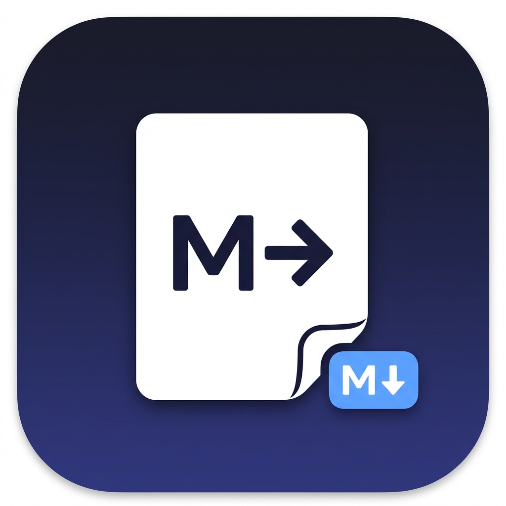

# MarkItDown Desktop

> A polished, production-ready macOS desktop application for converting documents to Markdown — powered by Microsoft's [MarkItDown](https://github.com/microsoft/markitdown) library.



---

## ⚠️ Disclaimer

**MarkItDown Desktop** is an independent, open-source project and is **not** an official Microsoft product. It is not sponsored, endorsed, or affiliated with Microsoft Corporation. The application uses Microsoft's open-source `markitdown` Python library (MIT license) as its conversion engine.

---

## Features

- 📂 **Drag & Drop** — Drop files directly onto the app
- 📁 **File Picker** — Native macOS file picker supporting multiple files
- 📄 **Multi-file Conversion** — Convert multiple files in parallel
- 👁️ **Markdown Preview** — Toggle between raw Markdown and rendered HTML preview
- 📋 **Copy Markdown** — One-click copy to clipboard with confirmation
- 💾 **Save Markdown** — Native macOS Save dialog, single or batch save
- ⚡ **Async Conversion** — Background processing, UI stays responsive
- 📊 **Progress Tracking** — Per-file progress bars + overall batch status
- 🕐 **Conversion History** — Sidebar panel with past conversions (metadata only)
- ⚙️ **Settings** — Persistent settings with theme, output, and plugin options
- 🌙 **Dark / Light Mode** — System-aware theme with manual override
- 🔒 **Local-First** — All conversion happens on your Mac, nothing is uploaded

---

## Supported Formats

| Format | Extension(s) |
|--------|-------------|
| PDF | `.pdf` |
| Word | `.docx`, `.doc` |
| PowerPoint | `.pptx`, `.ppt` |
| Excel | `.xlsx`, `.xls` |
| HTML | `.html`, `.htm` |
| CSV | `.csv` |
| JSON | `.json` |
| XML | `.xml` |
| ZIP | `.zip` |
| EPUB | `.epub` |
| Images | `.jpg`, `.jpeg`, `.png`, `.gif`, `.bmp`, `.webp`, `.tiff` |
| Audio | `.mp3`, `.wav`, `.m4a` |
| Outlook | `.msg` |
| Jupyter | `.ipynb` |
| Plain Text | `.txt`, `.md`, `.rst`, `.rtf` |

---

## Architecture

```
markitdown-desktop/
├── app/
│   ├── main.py                 # Entry point: QApplication + logging
│   ├── ui/
│   │   ├── main_window.py      # Central QMainWindow
│   │   ├── drop_zone.py        # Drag-and-drop widget
│   │   ├── file_list.py        # Per-file list with status/progress
│   │   ├── preview.py          # Raw + rendered Markdown preview
│   │   ├── history.py          # Conversion history sidebar
│   │   ├── settings_dialog.py  # Settings + Settings model
│   │   ├── about_dialog.py     # About screen
│   │   └── styles.py           # Dark/light QSS themes
│   ├── conversion/
│   │   ├── converter.py        # MarkItDown adapter (uses convert_local())
│   │   ├── manager.py          # QThreadPool-based async queue
│   │   ├── models.py           # FileItem, ConversionResult, HistoryEntry
│   │   └── exceptions.py       # User-friendly exception wrappers
│   └── services/
│       ├── clipboard.py        # System clipboard
│       ├── filesystem.py       # File picker / save dialogs
│       └── history.py          # History persistence (~/.markitdown-desktop/)
├── resources/
│   └── icons/                  # App icon (ICNS)
├── tests/
│   ├── fixtures/               # Sample test files
│   ├── test_converter.py       # Conversion layer tests
│   ├── test_services.py        # Service layer tests
│   └── test_ui.py              # UI smoke tests
├── scripts/
│   ├── setup.sh                # Create venv, install deps, gen fixtures
│   ├── dev.sh                  # Run app from source
│   ├── test.sh                 # Run test suite
│   ├── build_app.sh            # Build standalone .app
│   ├── build_dmg.sh            # Build distributable .dmg
│   └── clean.sh                # Remove build artifacts
└── packaging/
    ├── markitdown_desktop.spec # PyInstaller spec
    └── hooks/
        └── hook-markitdown.py  # Data collection hook
```

### Technology Stack

| Component | Technology | Reason |
|-----------|-----------|--------|
| GUI Framework | PySide6 (Qt 6) | Native macOS look, drag-and-drop, threading, LGPL |
| Conversion Engine | `markitdown[all]` | Official Microsoft library |
| Markdown Preview | `markdown` + Pygments + QWebEngineView | Full HTML rendering |
| Async | QThreadPool + QRunnable | Non-blocking UI during conversion |
| Packaging | PyInstaller | Bundles Python + all deps into `.app` |
| Persistence | QSettings (macOS plist) | Native macOS settings storage |

---

## Development Setup

### Prerequisites

- macOS 12 (Monterey) or later
- Python 3.12 (install via [Homebrew](https://brew.sh): `brew install python@3.12`)
- `create-dmg` (optional, for DMG: `brew install create-dmg`)

### Quick Start

```bash
# 1. Clone / open the project
cd markitdown-desktop

# 2. Run setup (creates venv, installs deps, generates test fixtures)
./scripts/setup.sh

# 3. Launch the app from source
./scripts/dev.sh
```

### Manual Setup

```bash
# Create virtual environment
python3.12 -m venv .venv
source .venv/bin/activate

# Install all dependencies
pip install "markitdown[all]" PySide6 markdown Pygments

# Generate test fixtures
python tests/fixtures/generate_fixtures.py

# Run the app
python -m app.main
```

---

## Running Tests

```bash
./scripts/test.sh

# Or manually:
source .venv/bin/activate
pytest tests/ -v
```

### Test Coverage

| Test File | Coverage |
|-----------|----------|
| `test_converter.py` | MarkItDown adapter, models, exceptions |
| `test_services.py` | History persistence, edge cases |
| `test_ui.py` | Widget instantiation, interactions |

---

## Building the macOS App

### Build .app

```bash
# Install build dependencies (adds PyInstaller)
source .venv/bin/activate
pip install pyinstaller

# Build
./scripts/build_app.sh
```

Output: `dist/MarkItDown Desktop.app`

### Build .dmg

```bash
# Requires create-dmg: brew install create-dmg
./scripts/build_dmg.sh
```

Output: `dist/MarkItDown-Desktop.dmg`

### Build Architecture

The app targets your current Mac architecture:
- **Apple Silicon (arm64)** — default on M1/M2/M3 Macs
- **Intel (x86_64)** — default on Intel Macs
- **Universal Binary** — set `target_arch="universal2"` in `packaging/markitdown_desktop.spec`

> **Note:** Universal binary requires both architectures' Python + PySide6 builds.

---

## Code Signing & Notarization

### Environment Variables

```bash
export APPLE_DEVELOPER_ID="Developer ID Application: Your Name (TEAMID)"
export APPLE_TEAM_ID="YOUR_TEAM_ID"
export APPLE_ID="your@apple.id"
export APPLE_APP_PASSWORD="xxxx-xxxx-xxxx-xxxx"  # App-specific password
```

### Signing

```bash
APPLE_SIGNING_IDENTITY="$APPLE_DEVELOPER_ID" ./scripts/build_app.sh
```

### Notarization

```bash
APPLE_ID="$APPLE_ID" \
APPLE_APP_PASSWORD="$APPLE_APP_PASSWORD" \
APPLE_TEAM_ID="$APPLE_TEAM_ID" \
./scripts/build_dmg.sh
```

### Unsigned Builds

Unsigned builds will trigger macOS Gatekeeper. Users can bypass by:
1. Right-click the app → **Open**
2. Or: System Settings → Privacy & Security → **Open Anyway**

---

## Privacy & Security

- ✅ **All conversion is local** — files never leave your Mac
- ✅ **No account required** — no login, no tracking
- ✅ **No internet required** — for local file conversions
- ✅ **Uses `convert_local()`** — MarkItDown's safest API for local files
- ✅ **Path validation** — prevents access to unintended filesystem locations
- ✅ **No shell injection** — no unsanitized user input passed to shell commands
- ✅ **Logs never store document contents** — only filenames and metadata
- ⚠️ **YouTube conversion requires internet** — clearly shown when used

---

## Troubleshooting

### App won't launch (Gatekeeper)

```bash
# Remove quarantine attribute
xattr -dr com.apple.quarantine "/Applications/MarkItDown Desktop.app"
```

### Conversion fails for a specific format

Ensure `markitdown[all]` is installed:
```bash
source .venv/bin/activate
pip install "markitdown[all]" --upgrade
```

### Open log files

Via the app: **Help → About → Open Logs Folder**  
Or manually: `~/.markitdown-desktop/logs/`

### PyInstaller build errors

```bash
# Clean and rebuild
./scripts/clean.sh
./scripts/build_app.sh
```

---

## Keyboard Shortcuts

| Shortcut | Action |
|----------|--------|
| ⌘O | Select Files |
| ⌘↩ | Convert |
| ⌘C | Copy Markdown |
| ⌘S | Save Markdown |
| ⌘⇧S | Save All Markdown |
| ⌘H | Toggle History Panel |
| ⌘, | Settings |
| ⌘W | Close Window |

---

## License

MIT License — see [LICENSE](LICENSE) for details.

### Relationship to Microsoft MarkItDown

This project uses the [`markitdown`](https://github.com/microsoft/markitdown) Python package (MIT License) as its conversion engine. The `markitdown` package is a Microsoft open-source project. The MarkItDown project explicitly identifies desktop GUI applications as out-of-scope for the upstream repository and encourages them to be maintained as separate projects.

This desktop application is independently developed and is not affiliated with or endorsed by Microsoft.

---

## Contributing

1. Fork this repository
2. Create a feature branch: `git checkout -b feature/my-feature`
3. Run tests: `./scripts/test.sh`
4. Submit a pull request
